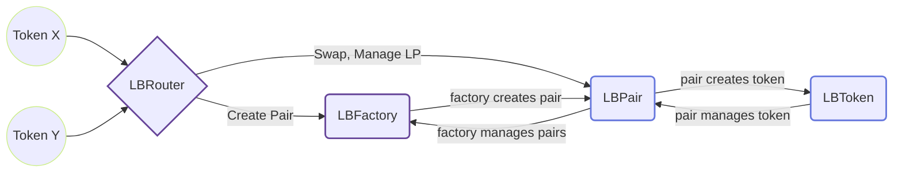

# Liquidity Book

A direct-as-possible port of [Joe-V2: Liquidity Book](https://github.com/traderjoe-xyz/joe-v2) to CosmWasm (specifically Secret).

This repository contains the Liquidity Book contracts, as well as tests and deploy scripts.

- The [LBPair](./contracts/lb_pair) is the contract that contains all the logic of the actual pair for swaps, adds, removals of liquidity and fee claiming. This contract should never be deployed directly, and the factory should always be used for that matter.
- The [LBToken](./contracts/lb_token) is the contract that is used to calculate the shares of a user. The LBToken is a new token standard that is similar to SNIP-1155, but without any callbacks (for safety reasons) and any functions or variables relating to SNIP-721.
- The [LBFactory](./contracts/lb_factory) is the contract used to deploy the different pairs and acts as a registry for all the pairs already created. There are also privileged functions such as setting the parameters of the fees, the flashloan fee, setting the pair implementation, set if a pair should be ignored by the quoter and add new presets. Unless the creationUnlocked is true, only the owner of the factory can create pairs.
- The [LBRouter](./contracts/lb_router) is the main contract that user will interact with as it adds security checks. Most users shouldn't interact directly with the pair.
- The [LBQuoter](./contracts/lb_quoter) is a contract that is used to return the best route of all those given. This should be used before a swap to get the best return on a swap.

