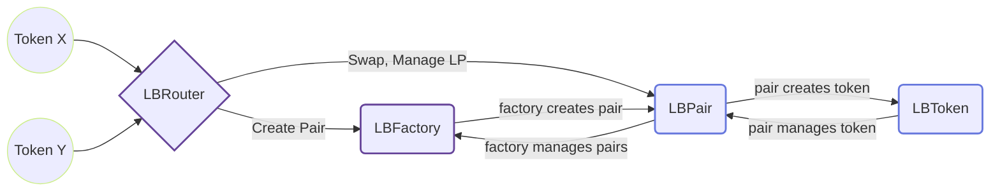

# Liquidity Book

Liquidity Book is an innovative, highly-capital efficient Automated Market Maker (AMM) protocol designed to support high volume trading with lower liquidity requirements. It introduces unique features that enhance the trading experience and optimize earnings for Liquidity Providers.

## Key Features

- **Zero Slippage**: Liquidity Book allows traders to swap tokens with zero slippage within designated bins, ensuring optimal trading conditions.
- **Surge Pricing**: During periods of high market volatility, Liquidity Providers earn additional dynamic fees, increasing their potential earnings.
- **High Capital Efficiency**: Unlike many existing AMMs, Liquidity Book supports high volume trading with significantly lower liquidity requirements.
- **Flexible Liquidity**: Liquidity Providers can strategically build flexible liquidity distributions according to their specific trading strategies.

## Comparing Liquidity Book and Uniswap V3

While both Liquidity Book and Uniswap V3 operate as concentrated liquidity AMMs, there are a few key differences:

| Feature                            | Liquidity Book                                                 | Uniswap V3                           |
| ---------------------------------- | -------------------------------------------------------------- | ------------------------------------ |
| Price Ranges                       | Discretized into bins                                          | Utilizes ticks                       |
| Invariant used                     | Constant sum                                                   | Constant product                     |
| Bin Steps/Tick Sizes               | Can be more than 1 basis point                                 | Generally 1 basis point              |
| Liquidity Aggregation              | Vertically aggregated                                          | Horizontally aggregated              |
| Fungibility of Liquidity Positions | Yes                                                            | No                                   |
| Liquidity Distribution             | Not restricted to uniform, can take any desired shape          | Typically uniform across price range |
| Swap Fees                          | Fixed + variable pricing, allows higher fees during volatility | Fixed pricing                        |
| Zero Slippage                      | Yes                                                            | No                                   |
| Surge Pricing                      | Yes                                                            | No                                   |
| High Capital Efficiency            | Yes                                                            | Variable                             |
| Flexible Liquidity Distributions   | Yes                                                            | Limited                              |

## Project Structure

This repository contains the Liquidity Book contracts, as well as tests and deploy scripts.

- The [LBPair](./contracts/lb_pair) contract contains all the logic of the actual pair for swaps, adds, removals of liquidity and fee claiming. This contract should never be deployed directly, and the factory should always be used for that matter.
- The [LBToken](./contracts/lb_token) contract is used to calculate the shares of a user. The LBToken is a new token standard that is similar to SNIP-1155.
- The [LBFactory](./contracts/lb_factory) contract is used to deploy the different pairs and acts as a registry for all the pairs already created. There are also privileged functions such as setting the parameters of the fees, the flashloan fee, setting the pair implementation, set if a pair should be ignored by the quoter, and add new presets.
- The [LBRouter](./contracts/lb_router) is the main contract that user will interact LbPair when swapping and managing liquidity.
- The [LBQuoter](./contracts/lb_quoter) is used to return the best route for a given token path. This should be used before a swap to get the best return on a swap.

