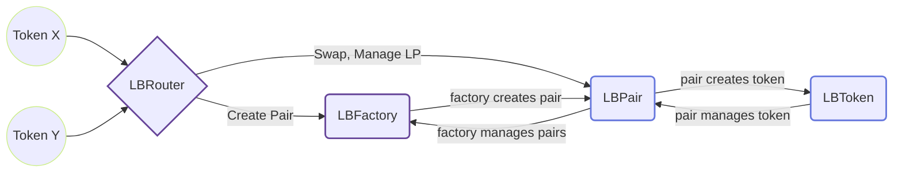

# Flow Diagrams

```mermaid
flowchart LR
      E((Token X))-->A;
      F((Token Y))-->A;
      A{LBRouter}-->|Create Pair| B(LBFactory);
      A-->|Swap, Manage LP| C;
      B-->|factory creates pair| C(LBPair);
      C-->|pair creates token| D(LBToken);
      D-->|pair manages token| C;
      C-->|factory manages pairs| B;
      style A stroke:#649,stroke-width:2px;
      style B stroke:#649,stroke-width:2px;
      style C stroke:#67d,stroke-width:2px;
      style D stroke:#67d,stroke-width:2px;
      style E stroke:#ce8,stroke-width:1px;
      style F stroke:#ce8,stroke-width:1px;
```
